# pi-coding 架构图（Mermaid）

> 来源：对 `crates/pi-coding`（约 128K 行 Rust）的结构分析。所有引用以 `<repo-root>/crates/...` 相对路径 + 行号给出，可执行验证：`grep -n "<symbol>" crates/pi-coding/src/<file>.rs`。

## 图 0 — 四层 crate 依赖

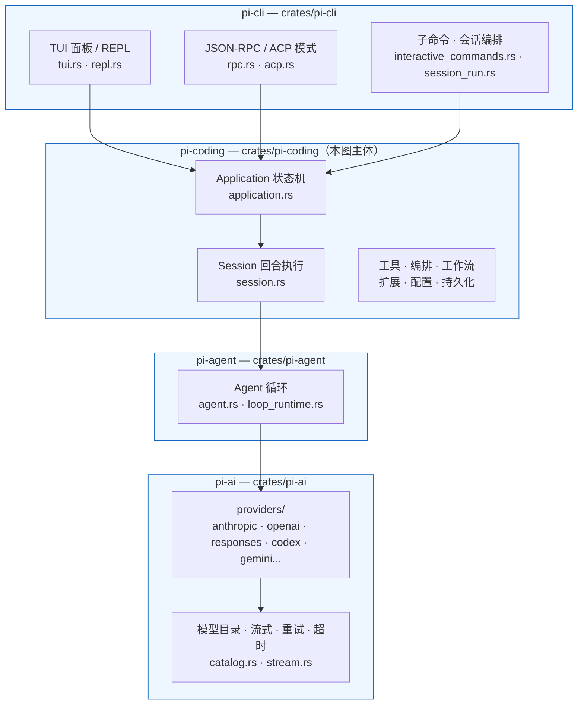

依赖方向（AGENTS.md 约束）：`pi-cli → pi-coding → pi-agent → pi-ai`，禁止跨层直取内部实现。

## 图 1 — pi-coding 内部模块全景

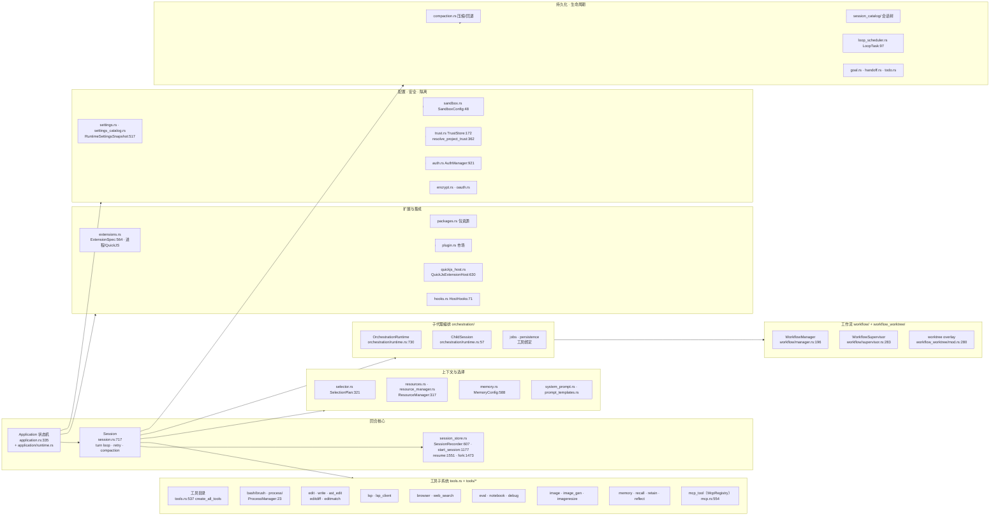

## 图 2 — 单回合运行时流水线（Sequence）

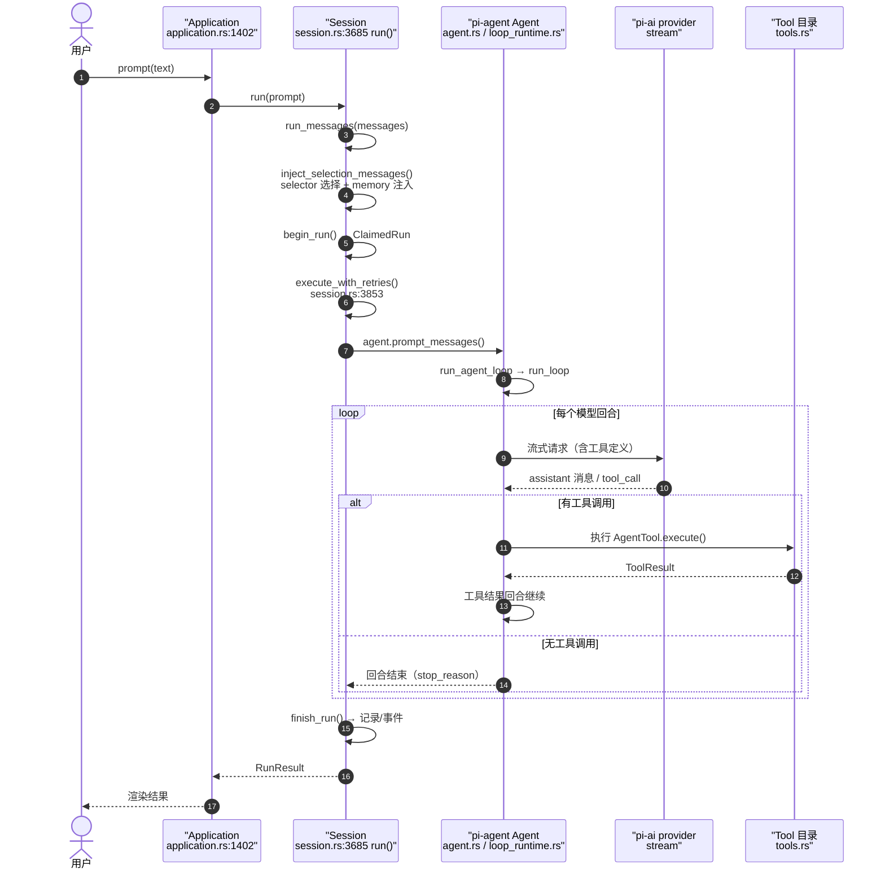

## 图 3 — 回合失败恢复决策（重试 / 回退 / 压缩）

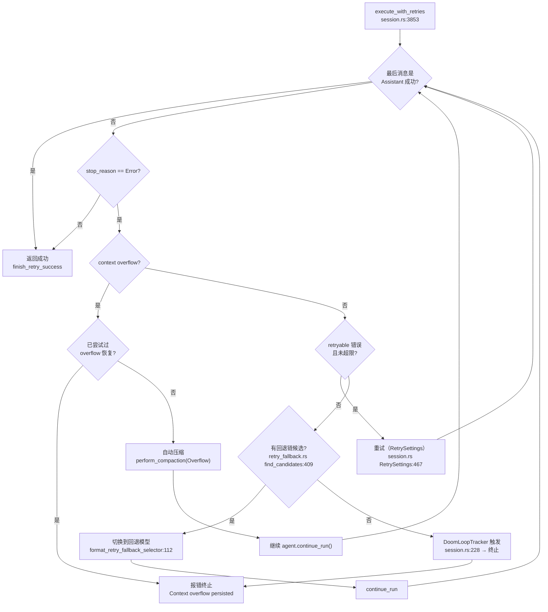

## 图 4 — pi-agent 循环内部

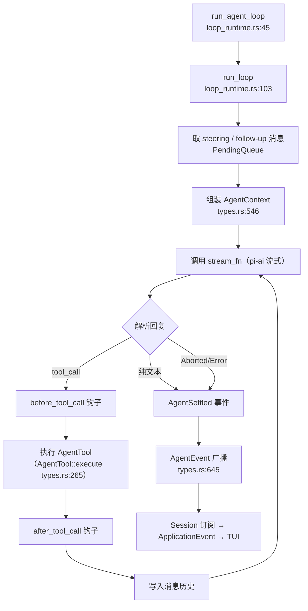

## 图 5 — 工具子系统

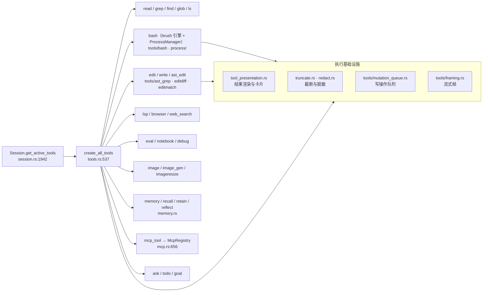

## 图 6 — 子代理编排（Orchestration）

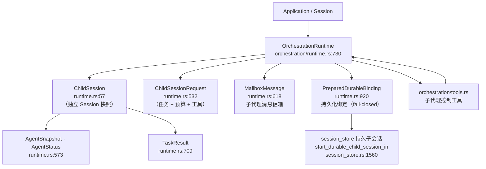

## 图 7 — 工作流（YAML DAG + worktree）

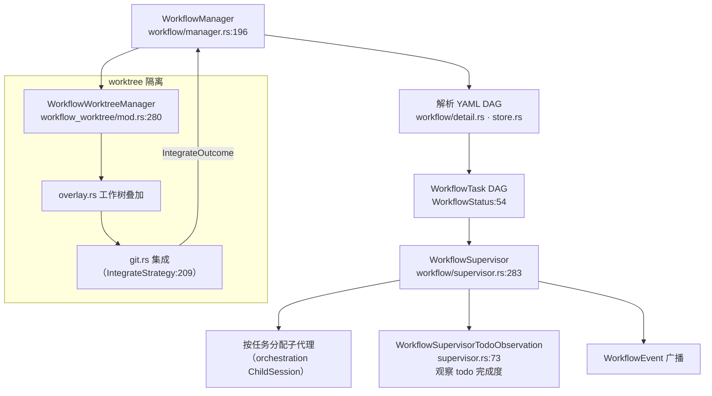

## 图 8 — 扩展 / 钩子 / 信任 / 沙箱 / MCP

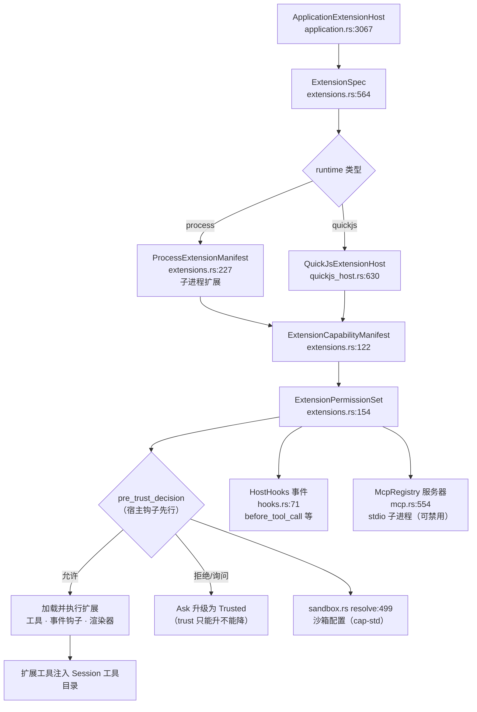

## 图 9 — 会话持久化与生命周期

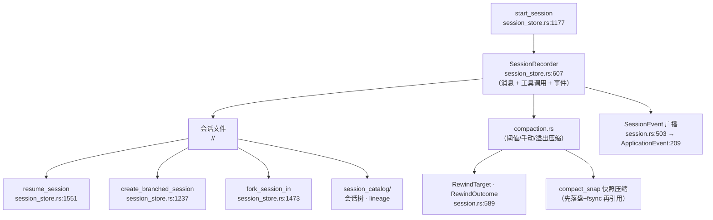

## 图 10 — 上下文装配管线（选择器 + 资源 + 系统提示词）

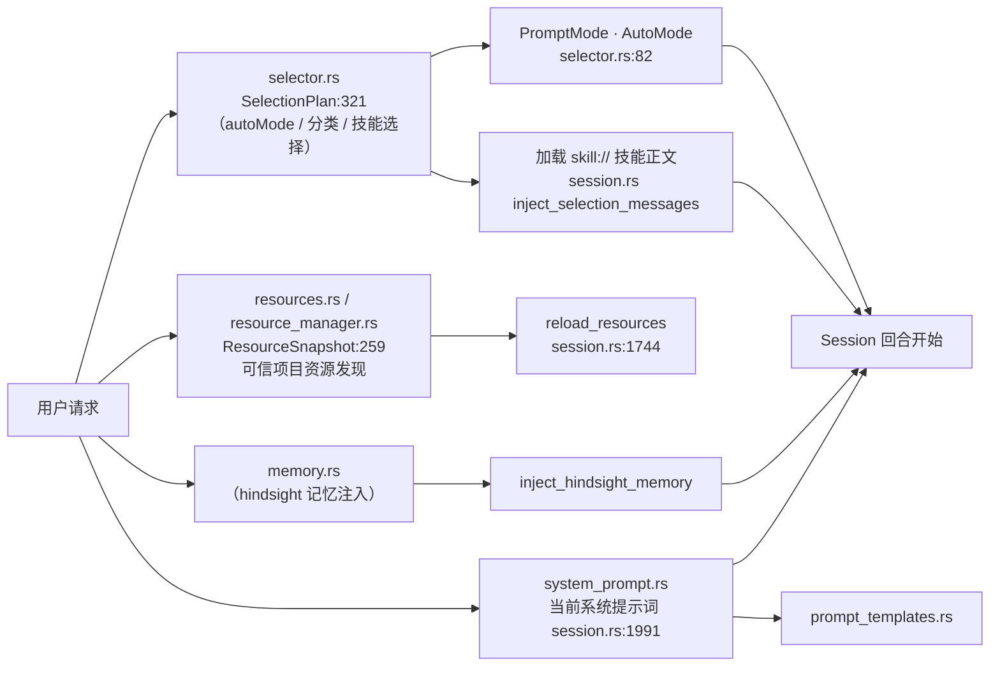

## 关键事实索引（可执行验证）

| 符号 | 位置 |
|---|---|
| `Session::new` | `crates/pi-coding/src/session.rs:723` |
| `Session::run` | `crates/pi-coding/src/session.rs:3685` |
| `execute_with_retries` | `crates/pi-coding/src/session.rs:3853` |
| `Application::new` / `Application::prompt` | `crates/pi-coding/src/application.rs:486` / `:1402` |
| `Agent`（pi-agent） | `crates/pi-agent/src/agent.rs:229` |
| `run_agent_loop` / `run_loop` | `crates/pi-agent/src/loop_runtime.rs:45` / `:103` |
| `create_all_tools` | `crates/pi-coding/src/tools.rs:537` |
| `OrchestrationRuntime` / `ChildSession` | `crates/pi-coding/src/orchestration/runtime.rs:730` / `:57` |
| `WorkflowManager` / `WorkflowSupervisor` | `crates/pi-coding/src/workflow/manager.rs:196` / `supervisor.rs:283` |
| `WorkflowWorktreeManager` | `crates/pi-coding/src/workflow_worktree/mod.rs:280` |
| `ExtensionSpec` / `QuickJsExtensionHost` | `crates/pi-coding/src/extensions.rs:564` / `quickjs_host.rs:630` |
| `McpRegistry` / `mcp_tool` | `crates/pi-coding/src/mcp.rs:554` / `:656` |
| `SessionRecorder` / `start_session` | `crates/pi-coding/src/session_store.rs:607` / `:1177` |
| `AuthManager` / `TrustStore` / `SandboxConfig` | `auth.rs:921` / `trust.rs:172` / `sandbox.rs:48` |
| `SelectionPlan` / `ResourceManager` / `MemoryConfig` | `selector.rs:321` / `resource_manager.rs:317` / `memory.rs:588` |
| `ProcessManager` | `crates/pi-coding/src/process/manager.rs:23` |
| `RuntimeSettingsSnapshot` | `crates/pi-coding/src/settings.rs:517` |

## 覆盖说明

- 全量阅读：`lib.rs` 模块导出、`session.rs`（回合/重试/压缩主路径）、`application.rs`（状态机与事件）、`tools.rs` 目录、`pi-agent` 循环、`session_store.rs` 持久化、`orchestration/runtime.rs`、`workflow/*`、`extensions.rs`、`auth/trust/sandbox` 核心类型。
- 摘要阅读（仅结构）：`settings.rs`、`mcp.rs`、`selector.rs`、`resource_manager.rs`、`compaction.rs`、`plugin.rs`、`packages.rs`、`markdown/*`。
- 未逐行展开：各 `tools/*` 内部实现、`tests.rs`、`session_catalog/tests.rs`。
